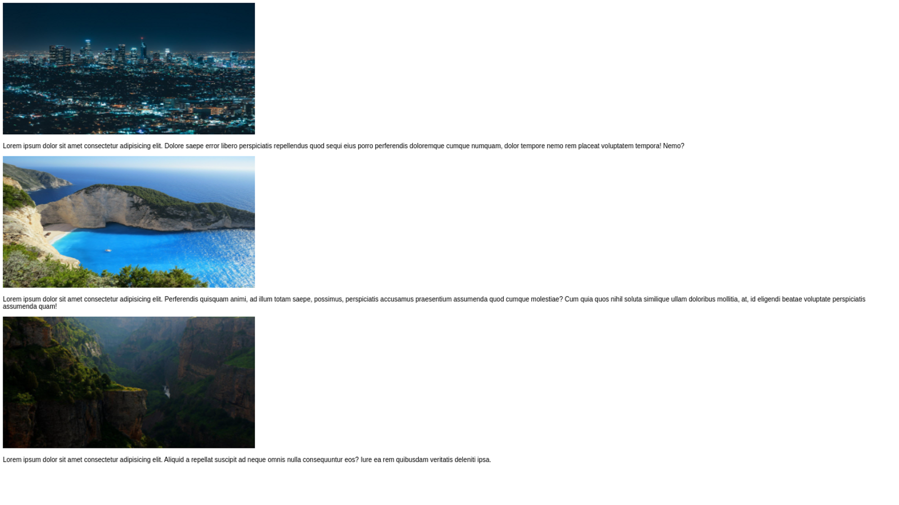

# Entendendo e utilizando media query

# Objetivos da Aula

- Trabalhar com responsividade na prática
- Dar os primeiros passos com responsividade

# Introdução

Fala programador, tudo bem com você? Nessa aula aqui nós vamos trabalhar na prática com a responsividade. Nós vamos entender como se aplica e como faremos para começar a utilizar ela nos nossos projetos.

# Visualização do layout

1. Nós vamos criar esse layout aqui, ele está aqui no snnipet de tamanho reduzido, você pode ver 100% na aula, busque criar ele antes de continuarmos 😀

   

# Criando o layout (HTML)

1. Nós iremos começar criando o html. Vamos colocar o layout padrão, mudando para pt-br e colocando o título na página.

   ```html
   <!DOCTYPE html>
   <html lang="pt-br">
   	<head>
   		<meta charset="UTF-8" />
   		<meta http-equiv="X-UA-Compatible" content="IE=edge" />
   		<meta name="viewport" content="width=device-width, initial-scale=1.0" />
   		<title>Responsividade</title>
   	</head>

   	<body></body>
   </html>
   ```

2. Agora, você pode baixar aqui as imagens que vamos utilizar nesse nosso teste de responsividade. Você vai colocar na mesma pasta que criamos essa pasta de imagens. ⇒ [https://drive.google.com/drive/folders/1KnHREpKkLe1WRC2-oTUKCtN3uuf4e0uw?usp=sharing](https://drive.google.com/drive/folders/1KnHREpKkLe1WRC2-oTUKCtN3uuf4e0uw?usp=sharing)
3. Com as imagens prontas, vamos então colocar as imagens com os textos lorem logo abaixo.

   ```html
   <!DOCTYPE html>
   <html lang="pt-br">
   	<head>
   		<meta charset="UTF-8" />
   		<meta http-equiv="X-UA-Compatible" content="IE=edge" />
   		<meta name="viewport" content="width=device-width, initial-scale=1.0" />
   		<link rel="stylesheet" href="./style.css" />
   		<title>Responsividade</title>
   	</head>

   	<body>
   		
   		<p>
   			Lorem ipsum dolor sit amet consectetur, adipisicing elit. Nobis rem
   			veritatis, a officia, molestias cumque vero incidunt doloremque
   			reiciendis aliquid repudiandae vitae, et illum explicabo? Praesentium
   			illum hic voluptatibus maxime esse numquam eius ad deleniti.
   		</p>

   		
   		<p>
   			Lorem ipsum dolor sit amet consectetur adipisicing elit. Quisquam,
   			aspernatur. Deserunt excepturi vitae enim non nihil expedita, hic porro
   			deleniti voluptatum quas quos tempora voluptatem.
   		</p>

   		
   		<p>
   			Lorem ipsum dolor sit amet consectetur adipisicing elit. Ipsa
   			architecto mollitia libero nesciunt fugiat nihil?
   		</p>
   	</body>
   </html>
   ```

4. E por último, nós iremos colocar as classes nos parágrafos e nos textos.

   ```html
   <!DOCTYPE html>
   <html lang="pt-br">
   	<head>
   		<meta charset="UTF-8" />
   		<meta http-equiv="X-UA-Compatible" content="IE=edge" />
   		<meta name="viewport" content="width=device-width, initial-scale=1.0" />
   		<link rel="stylesheet" href="./style.css" />
   		<title>Responsividade</title>
   	</head>

   	<body>
   		
   		<p class="text-content">
   			Lorem ipsum dolor sit amet consectetur, adipisicing elit. Nobis rem
   			veritatis, a officia, molestias cumque vero incidunt doloremque
   			reiciendis aliquid repudiandae vitae, et illum explicabo? Praesentium
   			illum hic voluptatibus maxime esse numquam eius ad deleniti.
   		</p>

   		
   		<p class="text-content">
   			Lorem ipsum dolor sit amet consectetur adipisicing elit. Quisquam,
   			aspernatur. Deserunt excepturi vitae enim non nihil expedita, hic porro
   			deleniti voluptatum quas quos tempora voluptatem.
   		</p>

   		
   		<p class="text-content">
   			Lorem ipsum dolor sit amet consectetur adipisicing elit. Ipsa
   			architecto mollitia libero nesciunt fugiat nihil?
   		</p>
   	</body>
   </html>
   ```

# Modificando o css

1. Agora, indo para o css, nós vamos colocar um tamanho fixo nas imagens. Vamos colocar tanto de largura quanto altura.

   ```css
   .img-content {
   	width: 765px;
   	height: 400px;
   }
   ```

2. Depois disso, nós vamos colocar um tamanho de fonte e também uma outra família de fonte.

   ```css
   .text-content {
   	font-size: 22px;
   	font-family: Arial, Helvetica, sans-serif;
   }
   ```

3. Com isso, nós vamos o nosso layout montado, faltando apenas a responsividade.

# Partindo para a responsividade

1. Como nós aprendemos na aula passada, vamos verificar a responsividade dessa nossa página, clicando em F12/inspecionar. Diminuindo a página, vamos ver que em 765 px a página começa a quebrar, pois é o tamanho fixo da nossa imagem.
2. Nós vamos então, utilizar o primeiro media query. Nós vamos utilizar ele em 795px, para ficar melhor de ver. O media query é feito a partir de um “max-width”. Quando esse width é atingido, nós vamos ter a implementação do estilo que está dentro do media query, mas mudando apenas coisas que nós colocarmos, não vai mudar tudo da página.
3. Para exemplo, vamos colocar o body com um background preto com textos brancos, e dentro desse nosso media query, colocar um background vermelho quando atingir os 795px.

   ```css
   body {
   	background-color: black;
   	color: white;
   }
   @media (max-width: 795px) {
   	body {
   		background-color: red;
   	}
   }
   ```

4. Com isso, nós vamos ver que ao chegar em 795px, o background vai alterar, só que, tanto a cor, quanto o tamanho do texto e da imagem, continuam. Então vamos agora apagar essas configurações do body, tanto dentro quanto fora do media query, e vamos colocar um novo tamanho de imagem.
5. Vamos colocar px novamente, só que, sabemos que o layout vai quebrar, pois px não é responsivo.

   ```css
   @media (max-width: 795px) {
   	.img-content {
   		width: 500px;
   	}
   }
   ```

6. Vamos ver que, ao chegar em 795px, a nossa imagem diminui, isso é o que queremos. Só que, o nosso texto ficou um pouco estranho, então nós vamos diminuir ele também.

   ```css
   @media (max-width: 795px) {
   	.img-content {
   		width: 500px;
   	}
   	.text-content {
   		font-size: 16px;
   	}
   }
   ```

7. Com isso, temos as duas alterações. Nós vamos agora começar a diminuir de novo, vamos ver que, em mais ou menos 500px ele vai começar a quebrar. Vamos agora colocar um novo media query, esse media query vai ter agora a imagem responsiva, então não usaremos mais px, usaremos agora porcentagem.
8. Vamos começar colocando 95% no tamanho da imagem, sem mexer na sua altura.

   ```css
   @media (max-width: 510px) {
   	.img-content {
   		width: 95%;
   	}
   }
   ```

9. Acabou ficando um pouco estranho esse nosso tamanho, você pode ver que por ele ter uma grande distância da “parede” do nosso aparelho, fica estranho. Vamos então colocar 100% de tamanho, e também deixar a altura automática.

   ```css
   @media (max-width: 510px) {
   	.img-content {
   		width: 100%;
   		height: auto;
   	}
   }
   ```

10. E agora, nós temos o nosso layout funcionando como nós queremos. Podemos ver que, até 280px ele vai funcionando perfeitamente.
11. Um detalhe importante é que, se você quiser, podemos ter algo puramente estético na responsividade também. Ou seja, algo que não vai ser alterado apenas por necessidade. Vamos colocar o texto alinhado no centro assim que der 410px.

    ```css
    @media (max-width: 410px) {
    	.text-content {
    		text-align: center;
    	}
    }
    ```

12. E com isso, nós vamos ter um layout adaptado para os nossos tamanhos de tela de acordo com o que queremos, manipulando por necessidade e também por estética.

# Código final

Aqui vai ficar o código final que temos na aula, para você conferir se bate com o seu. No caso, teremos aqui apenas o css, pois o html já foi colocado completo no começo.

```css
.img-content {
	width: 765px;
	height: 400px;
}
.text-content {
	font-size: 22px;
	font-family: Arial, Helvetica, sans-serif;
}

@media (max-width: 795px) {
	.img-content {
		width: 500px;
	}
	.text-content {
		font-size: 16px;
	}
}
@media (max-width: 510px) {
	.img-content {
		width: 100%;
		height: auto;
	}
}
@media (max-width: 410px) {
	.text-content {
		text-align: center;
	}
}
```

# Conclusão

Nessa aula demos então os primeiros passos com a nossa responsividade. Entendemos o que é media query e utilizamos ele pela primeira vez.
